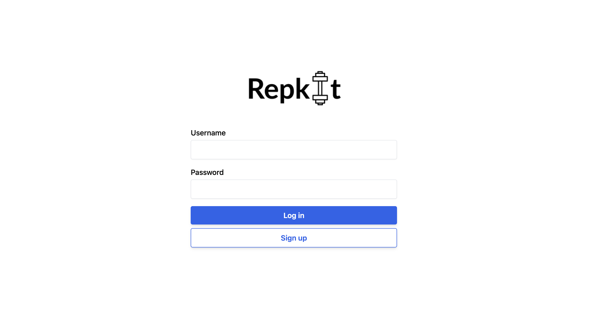

# Repkit

_**your reps, your kit, your way**_

Repkit is a full-stack web application designed to help you organise and track your workout sessions effortlessly. Create new workout sessions, name them, and add exercises with fully custom settings. For every exercise, a smart timer is automatically generated based on the sets, reps, and rest time you define. Stay focused, consistent, and in control throughout your workouts.

## Live Demo

Ready to work out? [Try Repkit now!](https://repkit.seansjlee.com)



## Features

- JWT-based user authentication and user-specific data management
- Create/manage workout sessions and exercises
- Track sets, reps, and rest periods with an interactive timer
- Responsive UI optimised for desktop and mobile

## Tech Stack

**Frontend**
- React (TypeScript)
- Vite
- Tailwind CSS
- Axios for API calls

**Backend**
- Spring Boot
- Spring Security with JWT
- PostgreSQL (via Spring Data JPA)
- RESTful API design

## Local Development

To run this project locally, you will need Java 17+, Node.js 18+, and Git installed

1. **Clone the repository**
    ```bash
    git clone https://github.com/seansjlee/repkit.git
    cd repkit
    ```
2. **Configure Environment Variables**
    
    Create a `.env` file in the backend directory:
    ```
    JWT_SECRET=your_jwt_secret_key
    JWT_EXPIRATION=86400000
    JWT_REFRESH_EXPIRATION=604800000
    ```

3. **Run the Backend (with H2 in-memory DB)**
    ```bash
   cd backend
   ./gradlew bootRun --args='--spring.profiles.active=local'
   ```
   The backend will be available at `http://localhost:8080`
   
   You can access the database console at `http://localhost:8080/h2-console`
   - JDBC URL: `jdbc:h2:mem:testdb`
   - Username: `sa`
   - Password: (leave empty)

4. **Run the Frontend**
    ```bash
    cd frontend
    npm install
    npm run dev
    ```
    The frontend will be available at `http://localhost:5173`

## License

This project is licensed under the MIT License - see the [LICENSE](LICENSE) file for details.